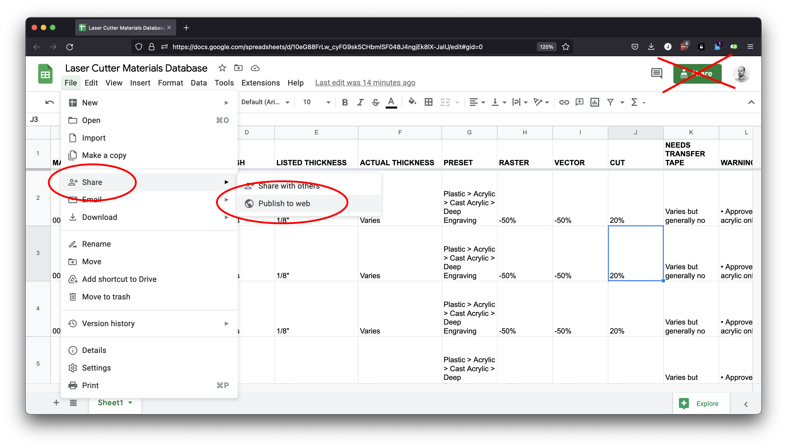
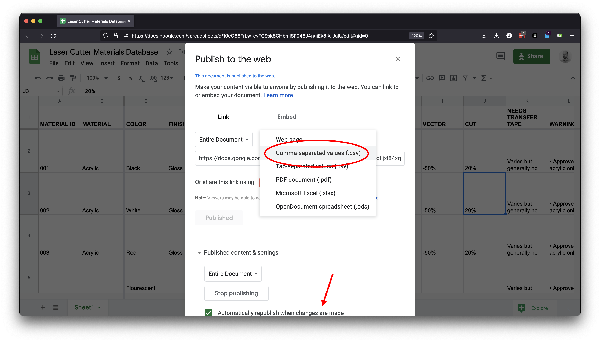
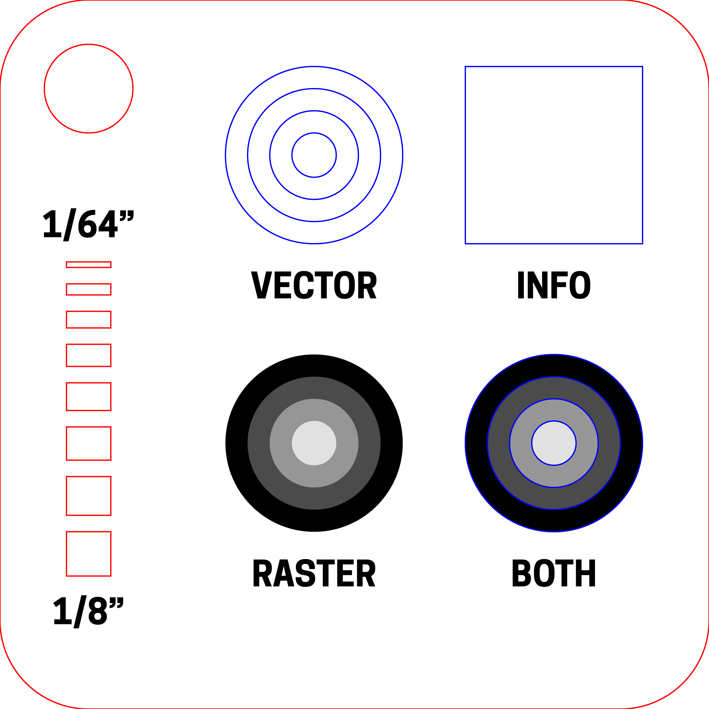

# Laser Materials Database

An easily-customizable website for keeping track of laser-cutter settings. Publishes everything from a Google Sheet (or `csv` file) and allows for cut/engrave adjustments, notes and warnings... and even generates QR codes for each material for easy access!

***

### LIVE DEMO  
You can view a working version of this project here: http://www.jeffreythompson.org/lasercutter  

Or scan this QR code to view a material listing: 

***

### CONTENTS

* [Thanks](#thanks)  
* [Creating your database](#creating-your-database)  
* [Settings](#settings)  
* [Listing materials](#listing-materials)  
* [Publishing your site](#publishing-your-site)  
* [QR codes](#qr-codes)  
* [Sample files](#sample-files)

***

### THANKS  
This project relies on several wonderful open-source projects:  

* [PapaParse.js](https://www.papaparse.com)  
* [p5.js](https://p5js.org)  
* [QRCode.js](https://github.com/davidshimjs/qrcodejs)  
* [Font Awesome](https://fontawesome.com)  

***

### CREATING YOUR DATABASE  
In order to make this process as easy as possible, especially for folks who have never made a website, I suggest using Google Sheets for your database. Alternatively, you can use a local `csv` file or export one from Excel.

The format for this spreadsheet needs to be exactly right for the site to work, so I suggest [starting with mine and duplicating the file](https://docs.google.com/spreadsheets/d/10eG88FrLw_cyFG9sk5CHbmlSF048J4ngjEk8lX-JaIU/edit#gid=0). We'll get into the various entries in a moment.

When you're ready to go, you'll need to create a version of the spreadsheet that the site can work with. In Sheets, go to `File → Share → Publish to Web...` (don't use the big `Share` button in the upper-right corner, it won't work for this!)



Make sure `Entire Document` is being shared and you've selected `Comma-separated values (CSV)` as the format.



Sheets will generate a link for you: grab it and you're ready for the next step! 

> Note! Definitely click the `Automatically republish when changes are made` option. This is super helpful: just update the spreadsheet and your site will reflect those changes a few minutes later!

***

### SETTINGS
To get the site working, you only need to modify one file: `settings.json`. Opening up the file, we see a few things we need to customize:

```json
{
  "location": "<where your laser is located>",
  "institution": "<who owns the laser?>",
  "csv": "<link to shared csv of your database>",
  "spreadsheetURL": "<link to the editable sheet>"
}
```

The `location` and `instution` settings will show up in the footer of the page. In my case, our lasercutter is in the `VA&T Fab Lab` and is owned by `Stevens Institute of Technology`. 

There are also two URLs: `csv` is the link to your database that we created earlier. If you're using a local `csv` file, just include the path and filename.

The `spreadsheetURL` is a quick link to your spreadsheet, letting folks quickly scan all the materials and for you to edit and add to it. Google Sheets will respect the edit settings you have in place, so it should be safe to include but if you'd prefer not to, you can leave this blank and it won't show up.

Putting it all together, this is what my `json` file looks like:

```json
{
  "location": "VA&T Fab Lab",
  "institution": "Stevens Institute of Technology",
  "csv": "https://docs.google.com/spreadsheets/d/e/2PACX-1vQosw77tzUa2cLjxi84xqp6F3EE-yAEF6Smk2UNMEUQQPEGdjUJD8gGwuV2sp5b7IQItggxT85A910y/pub?output=csv",
  "spreadsheetURL": "https://docs.google.com/spreadsheets/d/10eG88FrLw_cyFG9sk5CHbmlSF048J4ngjEk8lX-JaIU/edit?usp=sharing"
}
```

Save the file and that's it!

> 🤬 Be sure to put quotes around everything and don't forget a comma at the end of each line. Leaving that stuff out will cause an error...

***

### LISTING MATERIALS  
The spreadsheet containing your list of materials is intended to be easy to edit and add to! While it's probably pretty intuitive to understand, this section goes over everything in detail.

> The materials spreadsheet is set up in a particular way so it can work with the code for the website. Changing the names of columns will mess things up! If you have items you'd like added, please [create an issue here on Github](https://github.com/jeffThompson/LasercutterMaterialsDatabase/issues) and I'll do my best to add support. Or mod the code and submit a pull request!

**MATERIAL ID**  
A unique, three-digit ID for each material. This is used to create the URL for the material and should include [leading zeros](https://en.wikipedia.org/wiki/Leading_zero). For example, material `1` should be listed as `001`.

**MATERIAL**  
The name for the material. You can specify color, finish, and thickness later. Example: `Acrylic` or `Bamboo`

**COLOR**  
Optional: the color of the material. If not listed, this section won't be shown. Example: `Black` or `Flourescent blue`

**FINISH**  
Optional: the surface finish of the material. If not listed, this section won't be shown. Example: `Matte` or `Glossy` 

**LISTED THICKNESS**  
The thickness the material is *supposed* to be. If unknown or it varies, you can list that instead. Be sure to include the unit of measurement. Example: `0.125"` or `3mm` or `1/4-inch`

**ACTUAL THICKNESS**  
The measured thickness of the material, which is often different than the listed thickness. If unknown or it varies, you can list that instead. Example: `0.118"` or `3.2mm`

**PRESET**  
Which preset to use in your laser software. If split up using the `>` symbol, the website will replace this with a fancy arrow indicating nested presets. Example: `Plastic > Acrylic > Cast Acrylic > Deep Engraving` will render as...

```
Plastic
↳ Acrylic
  ↳ Cast Acrylic
    ↳ Deep Engraving
```

**RASTER**  
+/- change for raster engraving. If no change, leave blank. Can also say things like `(see note)` or any other text instead. Example: `20%` or `-15%`

**VECTOR**  
Same as `Raster` but for vector engraving.

**CUT**  
Same as `Raster` but for cutting.

**NEEDS TRANSFER TAPE**  
List whether a material needs transfer tape to be applied or not. Can be listed with any text. Example: `Yes` or `Not required but will help keep the matte side clean`

**WARNINGS**  
Any crucial warnings for users. Will be shown at the top with a bright background color. Multiple warnings can be listed on separate lines (in the same cell) with a bullet character at the start of each line, which will be turned into a nice-looking list! 

Example: `Glass can only be etched, not cut!` or...

```
• Original film must be removed before cutting!
• Approved acrylic only!
```

> 🤓 Hold down `Command/Control` and press `Enter` to create a new line in a cell.

**NOTES**  
Info that will help users get better results. These can be formatted just like the `Warnings`. Example: `Use transfer tape for the best etching and to avoid flames while cutting` or multiple items with bullets (as shown above)

**VENDOR**  
Where the material can be purchased from. If a `URL` is included, this will become a link. Example: `McMaster Carr` or `Inventables`

**URL**  
Optional: a link to where the material can be purchased.

**PRICE**  
The price charged to users. If blank, this will be ommitted. Be sure to add the currency. Example: `$14` or `£12.50`

***

### PUBLISHING YOUR SITE  
With everything set up, you just need to publish your site online. We won't go over that here, but you'll need somewhere to host the files so folks can get to them.

Just dump all of the files and you should be all set!

***

### QR CODES  
One bonus feature of this site is the auto-generated QR codes for each material. They are intended to be downloaded and printed on sticker paper, which you can apply to samples. Users can scan the code with their phones and voilà! They can view the details of the material.

The QR code for each material is listed at the bottom of its page, but you can also click the link at the bottom of the index page to download all of them in a single page.

***

### SAMPLE FILES  
This repository also includes a folder of sample files which we use in the VA&T Fab Lab. `SmallLaserTest.pdf` is a 2x2" test file to showcase cutting and engraving, and includes a 1/2" square area for the material's QR code.



The original Illustrator file and a desktop background are also included as bonus materials.

***

### TO DO
- No link when url is blank
- Tooltip is all uppercase (css not working yet)
- Warnings/notes: no list if just one bullet
- No price = remove that section

